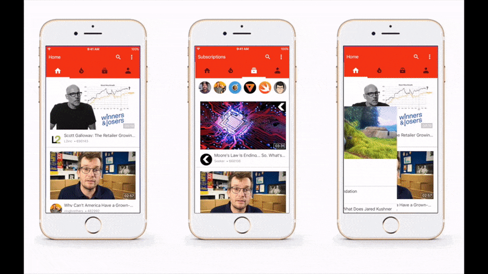

# iOS Template - Youtube

iOS Template - Youtube is developed by Adam Venord and written in Swift 3.

Purpose of this repo is to show how ViewControllers can be managed.

<h3 align="center">

</h3>

## Getting Started

All extra views are located in Navigation Controller and Main View Controller in storyboard.
<h3 align="center">

</h3>

## Compatibility

This project is written in Swift 3.0 and requires Xcode 8.2 or newer to build and run.

iOS Template - Youtube is compatible with iOS 9.1+.

## Author

* Adam Venord

## License

Copyright 2017 Adam Venord.

Licensed under MIT License: https://opensource.org/licenses/MIT
